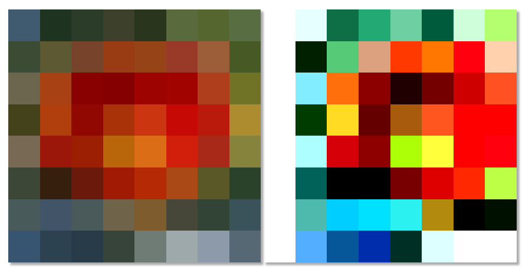
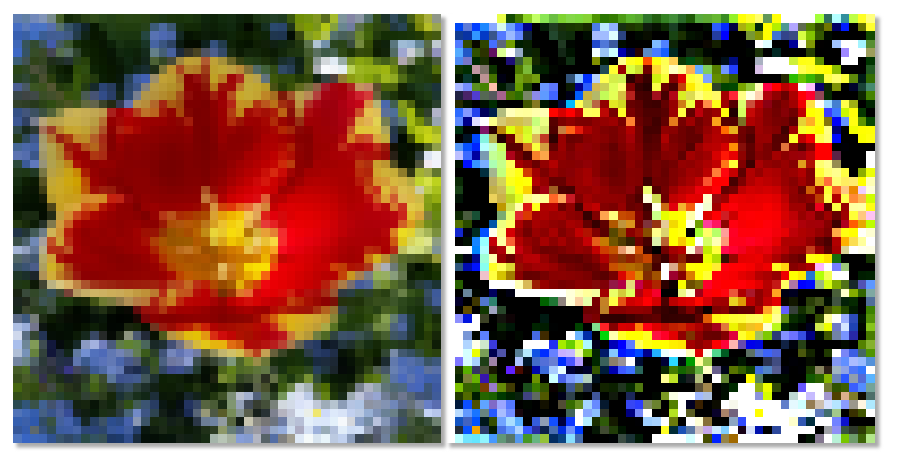
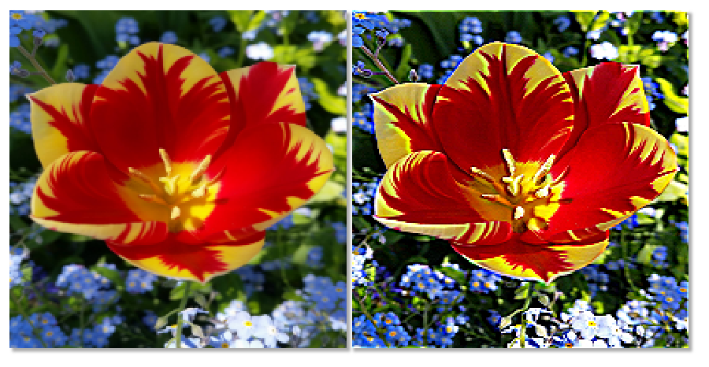

# Image Convolution Playground

## What are convolutional filters?

Convolutional filtering is the process of multiplying an n-dimensional matrix (kernel) of values against some other data, such as audio (1D), an image (2D), or video (3D). This allows for a wide range of different operations to be applied to the data.

## Image Convolutions

This interactive demo allows you to see how different convolution operations applied to images can be used to create effects such as blurring, sharpening, and edge detection. If you've used these filters in image editing programs like Photoshop, you've probably used convolutions.

Check out [this awesome demo](http://setosa.io/ev/image-kernels/) by [Victor Powell](https://twitter.com/vicapow) to learn more about applying convolutions to images.

## Image Convolution Playground

This is an interactive demo that demonstrates how filter kernels can be used to apply various effects to images. The demo has a number of different settings that can be adjusted to produce different effects

### Settings

#### Resolution

The slider near the top of the settings area can be used to change the resolution of the input and output images displayed on the right of the screen. A lower resolution will look more pixelated, but can process faster. A higher resolution will produce a more crisp image, but may slow down the program. The "Automatically update" setting can be disabled to reduce slowdown.

Any image resolution from 8 pixels to 200 pixels can be set. This is both the width and the height of the input and output images. New images that are loaded into the program will be resized to fit this resolution.

The indicator beneath the resolution slider displays the current image resolution. Hovering over the text will display a tooltip with the total area of the image in pixels.

By default, the image will be re-filtered whenever the resolution is changed. To disable this, turn off "Automatically update."

### To-do

Many features are still planned to make this project even better.

 - [Image download option](https://github.com/generic-github-user/Image-Convolution-Playground/issues/13)
 - [Saving settings, images, and custom filter kernels in the browser](https://github.com/generic-github-user/Image-Convolution-Playground/issues/3)

See the [issues page](https://github.com/generic-github-user/Image-Convolution-Playground/issues) for more information.

### Resources

#### Filters

Sources of convolutional filter kernels used in this demo.

- https://en.wikipedia.org/wiki/Kernel_(image_processing)
 - Sharpen
 - Box blur
 - Gaussian blur
   - 3 by 3
   - 5 by 5
 - Unsharp masking

## Other Notes

Image used for early testing of program:
https://i.imgur.com/vXiaCO3.jpg
